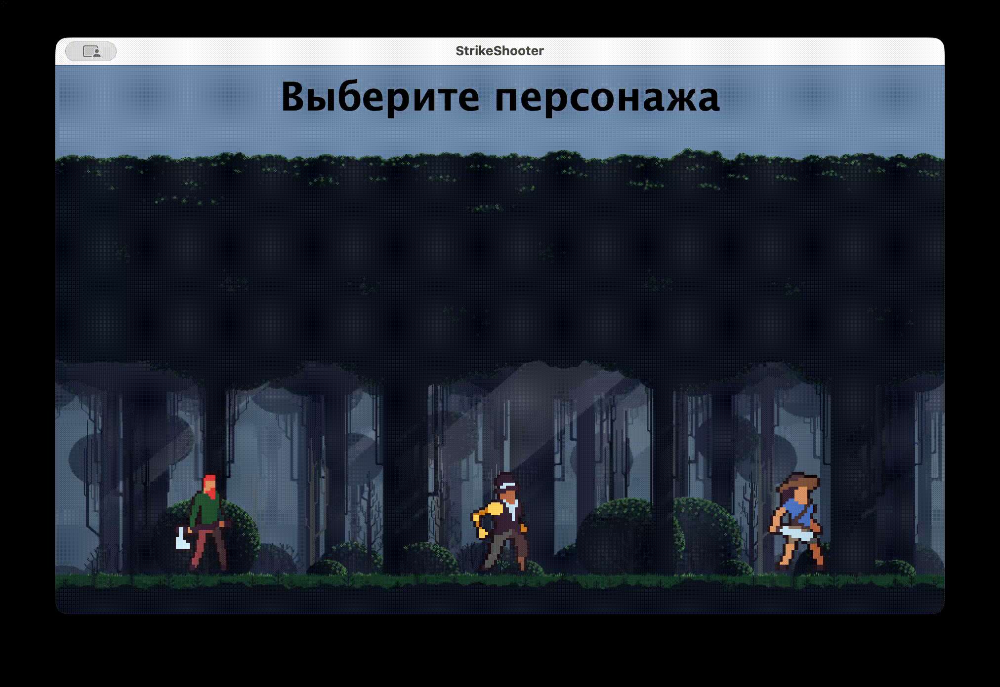
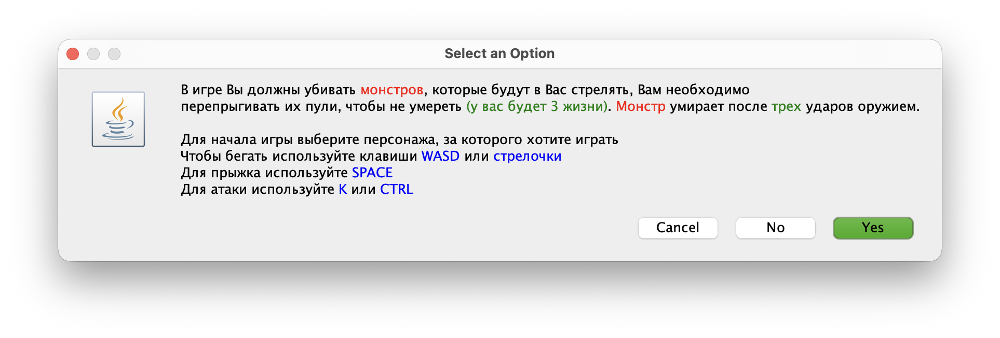

# COUNTER-STRIKE2.0

**Простая игра-шутер**

# Что это?
Игра, созданная для защиты экзамена по информатике в 11 классе. В игре реализована анимация всех действий и движений, все спрайты взяты из открытых источников, некоторые были созданы вручную. Весь код написан с использование ООП

# Как запустить?
**Windows**
1. Скачать [Java19](https://www.oracle.com/java/technologies/downloads/#jdk19-windows)
2. Перекинуть в папку jdk19
3. Открыть CMD
4. cd <путь к папке с проектом>
5. jdk19\bin\java -jar StrikeShooter.jar
6. Играть!

**MacOS**
1. Скачать [Java19](https://www.oracle.com/java/technologies/javase/jdk19-archive-downloads.html)
2. Открыть терминал
3. cd <путь к проекту>
4. java -jar StrikeShooter.jar
5. Играть!

# Технологии
- Java
  
# Как играть?

# Демонстрация проекта

[Пример игры](https://youtu.be/3NEQ5K6eK28)
